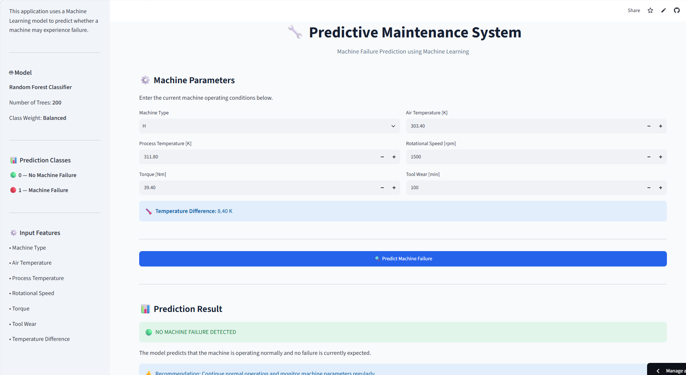

# 🔧 Predictive Maintenance System

## 📌 Project Overview

Predictive Maintenance is a Machine Learning-based approach used to predict whether an industrial machine is likely to experience a failure based on its operating conditions.

This project develops a **Machine Failure Prediction System** using a **Random Forest Classifier** and provides an interactive web application using **Streamlit**.

The system accepts machine operating parameters such as temperature, rotational speed, torque, and tool wear and predicts whether a machine failure is likely to occur.

---

# 🎯 Problem Statement

Unexpected machine failures can result in:

- Production downtime
- Increased maintenance costs
- Equipment damage
- Reduced productivity
- Safety risks

Traditional maintenance methods often rely on fixed schedules or reactive repairs.

The objective of this project is to develop a machine learning system that can identify potential machine failures from operational data and support **preventive maintenance decisions**.

---

# 🎯 Project Objectives

The main objectives of this project are:

1. Analyze industrial machine sensor data.
2. Perform data preprocessing and feature engineering.
3. Handle class imbalance in the target variable.
4. Train a Machine Learning model for failure prediction.
5. Evaluate the model using multiple performance metrics.
6. Identify the most important machine parameters.
7. Develop an interactive Streamlit application.
8. Provide actionable maintenance recommendations.

---

# 📊 Dataset

The project uses the **AI4I 2020 Predictive Maintenance Dataset**.

The dataset contains machine operating conditions and machine failure information.

### Target Variable

```text
Machine failure
```

---

## 📸 Application Screenshots

### 🖥️ Streamlit Dashboard


